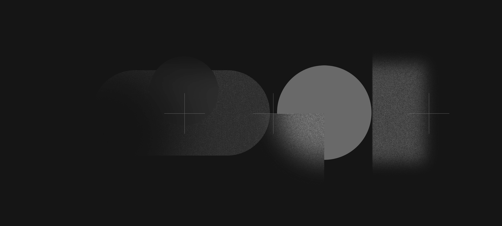

<div align="center">

# ✦ Qwenix KDE Plasma Config ✦

**Персонализированный, минималистичный и производительный рисовый  для KDE Plasma 6 на базе CachyOS / Arch Linux.**

[](https://archlinux.org/)
[](https://cachyos.org/)
[](https://kde.org/)
[](install.sh)

<br>



</div>

---

### ✨ Визуальный стек и оформление

* **Оконные декорации:** `Utterly-Round-Dark` — закругленные рамки с кастомными кнопками в стиле macOS через движок Aurorae v2.
* **Цветовая палитра:** `MkosBigSurDark` — контрастная темная тема с акцентными системными цветами.
* **Тема курсоров:** `FossaCursors` — сглаженные векторные указатели.
* **Базовая тема:** `org.kde.breezedark.desktop` — надежная системная основа для трея и виджетов.
* **Обои:** Фирменный бэкграунд `wallpaper.png`, устанавливаемый через D-Bus API Plasma Shell.
* **Конфигурации:** Автоматическая фиксация раскладки панелей, шорткатов клавиатуры и чувствительности мыши (`kcminputrc`, `kwinrc`, `kglobalshortcutsrc`).

---

### 📦 Устанавливаемые пакеты

Скрипт `install_packages.sh` автоматически считывает манифесты из корня репозитория и накатывает окружение:

| Источник | Файл конфигурации | Назначение |
| :--- | :--- | :--- |
| **Официальные зеркала (`pacman`)** | `packages.txt` | Базовые зависимости KDE, системные утилиты, библиотеки рендеринга и CLI-инструменты |
| **Arch User Repository (`paru` / `yay`)** | `aur-packages.txt` | Пакеты из AUR: кастомные шрифты, системные виджеты и темы |
| **Flathub (`flatpak`)** | `flatpak-packages.txt` | Изолированные десктопные приложения, мессенджеры и медиа-софт |

> Вы можете изменить состав софта перед установкой, отредактировав соответствующие `.txt` файлы в корне папки.

---

### 🚀 Быстрая установка

Самый надежный способ установки — последовательный запуск команд:

```bash
git clone [https://github.com/qwenix123/Qwenix-Kde-plasma-config.git](https://github.com/qwenix123/Qwenix-Kde-plasma-config.git) ~/qwenix-config
cd ~/qwenix-config
./install.sh<div align="center">

# ✦ Qwenix KDE Plasma Config ✦

**Персонализированный, минималистичный и производительный  сетап для KDE Plasma 6 на базе CachyOS / Arch Linux.**

[](https://archlinux.org/)
[](https://cachyos.org/)
[](https://kde.org/)
[](install.sh)

<br>


</div>

---

### ✨ Визуальный стек и оформление

* **Оконные декорации:** `Utterly-Round-Dark` — закругленные рамки с кастомными кнопками в стиле macOS через движок Aurorae v2.
* **Цветовая палитра:** `MkosBigSurDark` — контрастная темная тема с акцентными системными цветами.
* **Тема курсоров:** `FossaCursors` — сглаженные векторные указатели.
* **Базовая тема:** `org.kde.breezedark.desktop` — надежная системная основа для трея и виджетов.
* **Обои:** Фирменный бэкграунд `wallpaper.png`, устанавливаемый через D-Bus API Plasma Shell.
* **Конфигурации:** Автоматическая фиксация раскладки панелей, шорткатов клавиатуры и чувствительности мыши (`kcminputrc`, `kwinrc`, `kglobalshortcutsrc`).

---

### 📦 Устанавливаемые пакеты

Скрипт `install_packages.sh` автоматически считывает манифесты из корня репозитория и накатывает окружение:

| Источник | Файл конфигурации | Назначение |
| :--- | :--- | :--- |
| **Официальные зеркала (`pacman`)** | `packages.txt` | Базовые зависимости KDE, системные утилиты, библиотеки рендеринга и CLI-инструменты |
| **Arch User Repository (`paru` / `yay`)** | `aur-packages.txt` | Пакеты из AUR: кастомные шрифты, системные виджеты и темы |
| **Flathub (`flatpak`)** | `flatpak-packages.txt` | Изолированные десктопные приложения, мессенджеры и медиа-софт |

> Вы можете изменить состав софта перед установкой, отредактировав соответствующие `.txt` файлы в корне папки.

---

### 🚀 Быстрая установка

Самый надежный способ установки — последовательный запуск команд:

```bash
git clone [https://github.com/qwenix123/Qwenix-Kde-plasma-config.git](https://github.com/qwenix123/Qwenix-Kde-plasma-config.git) ~/qwenix-config
cd ~/qwenix-config
./install.sh
